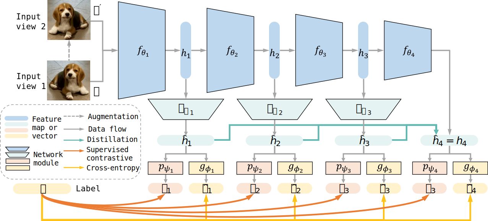

# Leveraging Multiple Deep Experts for Online Class-incremental Learning (ICME 2025)
Implementation of "Leveraging Multiple Deep Experts for Online Class-incremental Learning" (ICME 2025).
This repository also includes MOSE and several baseline methods for online continual learning.

## Overview

Figure: MOSE overview (baseline).

## Methods
This repository includes:
- DExpert (`--method deep_expert` or `--method dexpert`)
- MOSE (`--method mose`)
- Baselines: ER, SCR, Distill, Buf, Joint (`--method er|scr|dist|buf|joint`)

## Project Structure
- `agent/`: continual learning methods (including DExpert)
- `experiment/`: dataset loading and task preparation
- `models/`, `losses/`, `utils/`: model and training utilities
- `scripts/`: experiment shell scripts

## Installation
### Requirements
- Python >= 3.8 (tested with 3.8)
- PyTorch >= 1.10 (tested with 1.12.1)

```
# Install PyTorch following the official instructions, then:
pip install -r requirements.txt
```

## Datasets
- CIFAR-10/100 and TinyImageNet are downloaded and processed under `./data` by default.
- Processed splits are cached as `./data/binary_*`; remove them to rebuild splits.
- ImageNet-1k expects a folder with `train/` and `val/` subfolders. The default path is
  `/home/ubuntu/datasets/imagenet-1k` in `experiment/dataset.py` (update `data_root` to your path).

## Quickstart
**DExpert on Split CIFAR-100**

```bash
python main.py \
--dataset           cifar100 \
--buffer_size       5000 \
--method            deep_expert \
--nums_expert       4 \
--seed              0 \
--run_nums          5 \
--gpu_id            0
```

**MOSE on Split CIFAR-100**

```bash
python main.py \
--dataset           cifar100 \
--buffer_size       5000 \
--method            mose \
--seed              0 \
--run_nums          5 \
--gpu_id            0
```

**MOSE on Split TinyImageNet**

```bash
python main.py \
--dataset           tiny_imagenet \
--buffer_size       10000 \
--method            mose \
--seed              0 \
--run_nums          5 \
--gpu_id            0
```

## Scripts
See `scripts/` for additional experiment presets. Run them from the repo root, e.g. `bash scripts/run.sh`.

## Acknowledgement
Thanks the following code bases for their framework and ideas:
- [OnPro](https://github.com/weilllllls/OnPro)
- [GSA](https://github.com/gydpku/GSA)
- [OCM](https://github.com/gydpku/OCM)
- [Awesome-Incremental-Learning](https://github.com/xialeiliu/Awesome-Incremental-Learning)

## Citation
If you use this code, please cite:

```bibtex
@inproceedings{yan2025dexpert,
  title={Leveraging Multiple Deep Experts for Online Class-incremental Learning},
  author={Yan, Hongwei and Wang, Liyuan and Ma, Kaisheng and Zhong, Yi},
  booktitle={IEEE International Conference on Multimedia and Expo (ICME)},
  year={2025}
}
```

## License
MIT

## Contact
Open an issue for questions or bug reports.
